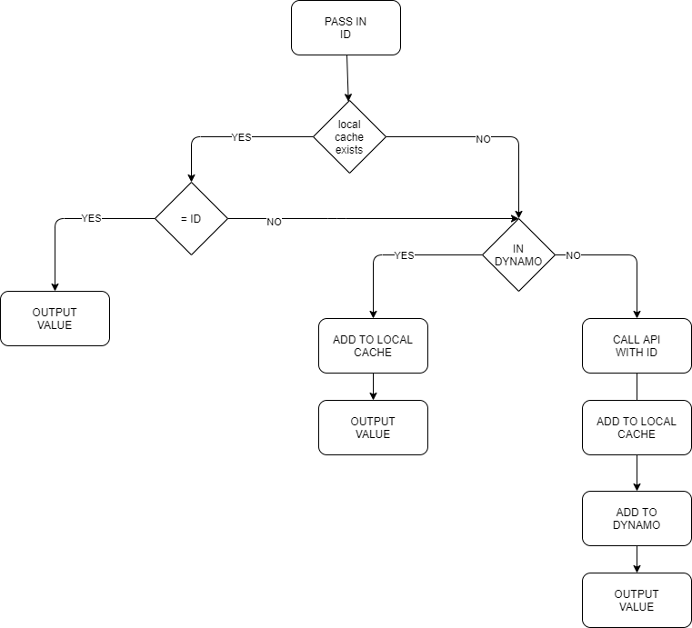

# Warm Start

Purpose of this project is to use Warm Start up to retrieve a value from lambda cache.  However, for cold start up we want to pull the values from DynamoDB, or the originating URL (in this case just using example.com).

Also, want to setup an invalidation of local cache.

I use a data lookup to recreate the lambda_function.zip file so any code change will be picked up when deployed

## Prerequisites
Before you begin, make sure you have the following prerequisites:

* [Terraform](https://developer.hashicorp.com/terraform/tutorials/aws-get-started/install-cli) installed on your local machine.
* An AWS account with sufficient privileges to create EC2 instances and security groups.
* AWS access key and secret key with sufficient permissions to create resources.

## Infrastructure Setup

* Clone the repository to your local machine.
* Navigate to the project directory.
* Create a `terraform.tfvars` adding your AWS_ACCESS_KEY, AWS_SECRET_KEY, and REGION.
* Run `terraform init` to download the necessary provider plugins.
* Run `terraform plan` to preview the changes that Terraform will make to your infrastructure.
* Run `terraform apply` to create the infrastructure on AWS.
* When you are finished using the infrastructure, run `terraform destroy` to delete all the resources that Terraform created.

## Cache Flowchart

## Resources

* [Terraform Documentation](https://developer.hashicorp.com/terraform/docs)
* [AWS Provider Documentation](https://registry.terraform.io/providers/hashicorp/aws/latest/docs)