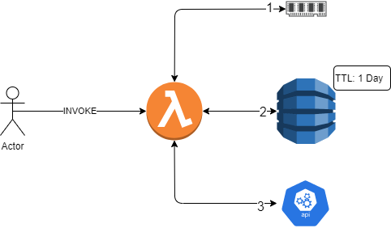

# Warm Start

Purpose of this project is to use Warm Start up to retrieve a value from lambda memory.  However, for cold start up we want to pull the values from DynamoDB (if they exist), and finally from the originating API/Source (in this case just using example.com).

Also, want to setup an invalidation of the values in DynamoDB using TTL to simulate cache invaludation so can keep the data "fresh".  In this example I use 24 hour ttl on my dynamodb table.


I use a data lookup to recreate the lambda_function.zip file so any code change will be picked up when deployed

## Rough Topology



### Steps

1. Actor invokes lambda passing in ID (number)
2. Lambda checks local memory (warm start) variable see if it matches
    * if yes 
      * returns value
    * if no 
      * step 3
3. Checks dynamodb to see if in "system" cache
    * if yes:
      * adds to local memory
      * returns value
    * if no 
      * step 4
4.  Calls API to retrieve ID and value
    * adds to Dynamo (system cache)
    * adds to local memory
    * returns value


## Cache Flowchart


## Prerequisites
Before you begin, make sure you have the following prerequisites:

* [Terraform](https://developer.hashicorp.com/terraform/tutorials/aws-get-started/install-cli) installed on your local machine.
* An AWS account.
* AWS access key and secret key with sufficient permissions to create resources.

## Infrastructure Setup

* Clone the repository to your local machine.
* Navigate to the project directory.
* Create a `terraform.tfvars` adding your AWS_ACCESS_KEY, AWS_SECRET_KEY, and REGION.
* Run `terraform init` to download the necessary provider plugins.
* Run `terraform plan` to preview the changes that Terraform will make to your infrastructure.
* Run `terraform apply` to create the infrastructure on AWS.
* When you are finished using the infrastructure, run `terraform destroy` to delete all the resources that Terraform created.

## Running Lambda

### Through AWS Console

* Navigate to lambda console and select function
* click on **test**
* Select **Create new event** and use following JSON (id can be what you want)

```json
{
  "id": 15
}
```

* Click **Test**

### Through AWS CLI

* log into AWS through the CLI
* run the following command `aws lambda invoke \
--function-name warmstart \
--payload '{"id": "15"}' \
output.json
`

## Resources

* [Terraform Documentation](https://developer.hashicorp.com/terraform/docs)
* [AWS Provider Documentation](https://registry.terraform.io/providers/hashicorp/aws/latest/docs)
* [Time To Live Dynamo](http://i-cloudconsulting.com/aws-dynamodb-ttl-setting-up-grammatically/)